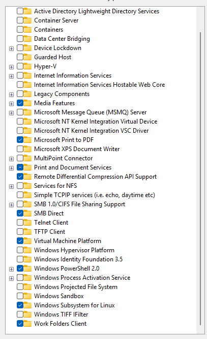

- If you are a macOS user please skip this
## Enable wsl
- Windows + features
- Uncheck Hyper-V
- Check Virtual Machine Platform
- Check Windows Subsystem for Linux



---

- Restart computer

## Install wsl distro
### Open powershell with administrator
```commandline
wsl --list --online
```

- Install oracle linux 8.10
```commandline
 wsl --install --distribution OracleLinux_8_10
```
- Enter username and password when prompt asks (train - Ankara06)
```
Enter new UNIX username: train
Changing password for user train.
New password: 
BAD PASSWORD: The password fails the dictionary check - it is based on a dictionary word
Retype new password:
passwd: all authentication tokens updated successfully.
Installation successful!
```
## Set default distribution
- Powershell
```
wsl --set-default OracleLinux_8_10
```

## Install Python 3.12
- Open Oracle Linux terminal
```
sudo dnf install python3.12.x86_64

sudo alternatives --config python
```
- Output
```
There are 3 programs which provide 'python'.

  Selection    Command
-----------------------------------------------
*+ 1           /usr/libexec/no-python
   2           /usr/bin/python3
   3           /usr/bin/python3.12

Enter to keep the current selection[+], or type selection number: 3
```

- Check version
```
python -V
```
- Output
```
Python 3.12.11
```
## Install pip
```
python -m ensurepip --upgrade

python -m pip install pip --upgrade
```

## Install WSL Extension


---

## Connect wsl
- Press Ctrl + Shift + P
- Type Remote WSL


## Add Python extension for WSL

## Install uv
```
curl -LsSf https://astral.sh/uv/install.sh | sh
```

## Create virtual environment
```
uv init week_05_08 -p 3.12

cd week_05_08
```