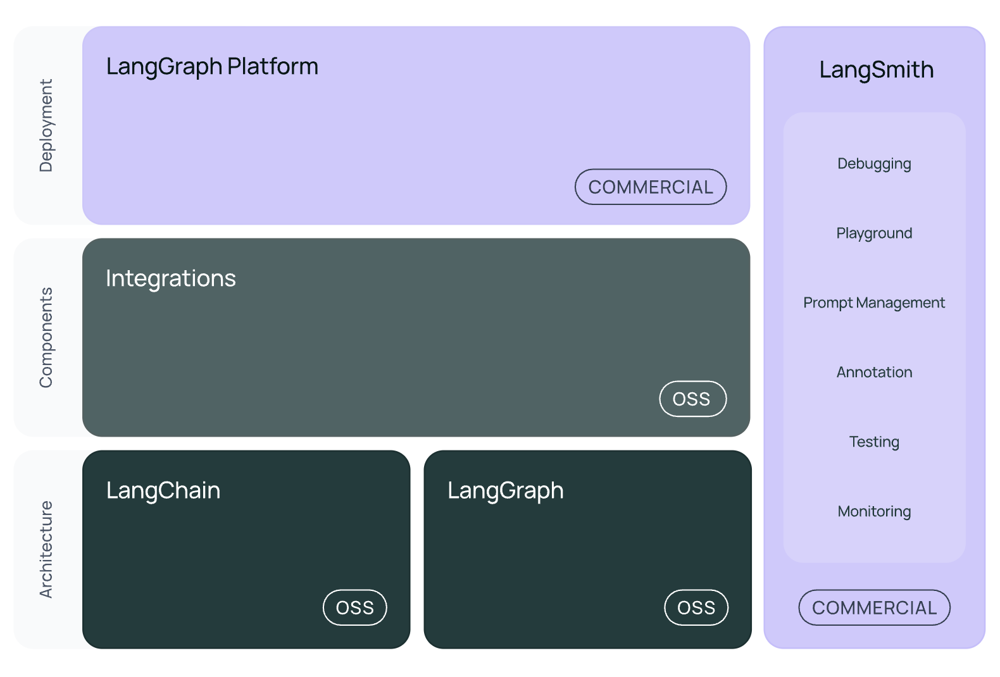

## LangChain Basics
- LangChain is a framework for developing applications powered by large language models (LLMs).

- LangChain simplifies every stage of the LLM application lifecycle:

    - **Development**: Build your applications using LangChain's open-source components and third-party integrations. Use LangGraph to build stateful agents with first-class streaming and human-in-the-loop support.
    - **Productionization**: Use LangSmith to inspect, monitor and evaluate your applications, so that you can continuously optimize and deploy with confidence.
    - **Deployment**: Turn your LangGraph applications into production-ready APIs and Assistants with LangGraph Platform.




---

- [Integrations](https://python.langchain.com/docs/integrations/providers/)


## Simple Example
- Get GOOGLE_API_KEY
- Add api key to .env
```
echo GOOGLE_API_KEY=yourapikeyhere >> .env
```
- install requirements.txt
```
cat<<EOF | tee requirements.txt
langchain==0.3.27
langchain-google-genai==2.1.8
python-dotenv==1.1.1
EOF

uv add -r requirements.txt
```

- simple_example.py
```
mkdir -p week_05/01_basic_setup_simple_example
cat<<EOF | tee week_05/01_basic_setup_simple_example/simple_example.py
from langchain.chat_models import init_chat_model
from dotenv import load_dotenv

load_dotenv()

model = init_chat_model("gemini-2.0-flash", model_provider="google_genai")
result = model.invoke("Hello, world!")
print(result.content)

EOF
````

- Run
```
uv run week_05/01_basic_setup_simple_example/simple_example.py 
```
- Output
```
Hello there! How can I help you today?
```