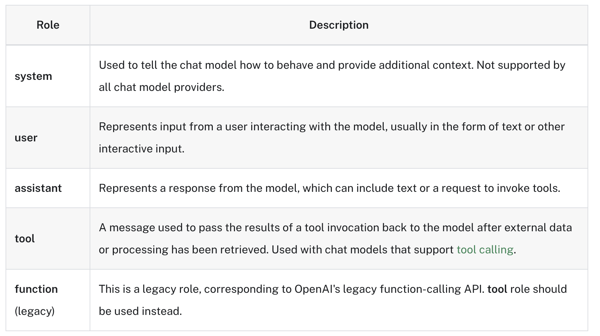
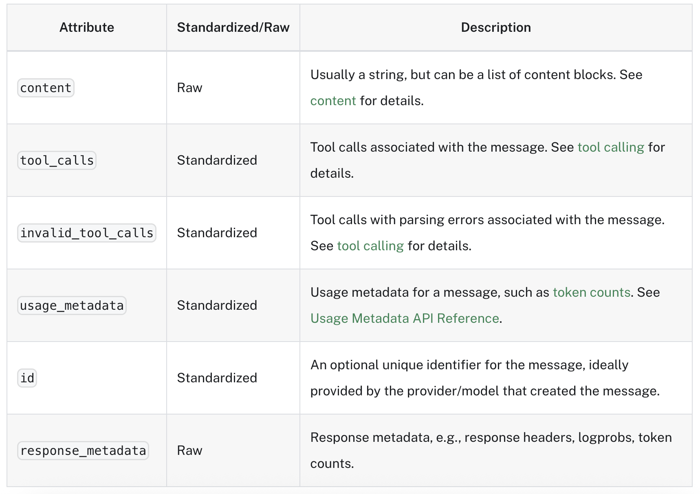

## Overview
- Messages are the unit of communication in chat models. They are used to represent the input and output of a chat model, as well as any additional context or metadata that may be associated with a conversation.
- Each message has a role (e.g., "user", "assistant") and content (e.g., text, multimodal data) with additional metadata that varies depending on the chat model provider.

- LangChain provides a unified message format that can be used across chat models, allowing users to work with different chat models without worrying about the specific details of the message format used by each model provider.

## What is inside a message?
### Role
Roles are used to distinguish between different types of messages in a conversation and help the chat model understand how to respond to a given sequence of messages.



- Source: https://python.langchain.com/docs/concepts/messages/

---

The content of a message text or a list of dictionaries representing multimodal data (e.g., images, audio, video).
Currently, most chat models support text as the primary content type, with some models also supporting multimodal data. However, support for multimodal data is still limited across most chat model providers.

### Other Message Data
- **ID:** An optional unique identifier for the message.
- **Name:** An optional name property which allows differentiate between different entities/speakers with the same role. Not all models support this!
- **Metadata:** Additional information about the message, such as timestamps, token usage, etc.
- **Tool Calls:** A request made by the model to call one or more tools> See tool calling for more information.

## langChain Messages
- LangChain messages are Python objects that subclass from a BaseMessage.
The five main message types are:

- SystemMessage: corresponds to system role
- HumanMessage: corresponds to user role
- AIMessage: corresponds to assistant role
- AIMessageChunk: corresponds to assistant role, used for streaming responses
- ToolMessage: corresponds to tool role

### SystemMessage
A SystemMessage is used to prime the behavior of the AI model and provide additional context, such as instructing the model to adopt a specific persona or setting the tone of the conversation (e.g., "This is a conversation about cooking").

### HumanMessage
The HumanMessage corresponds to the "user" role. A human message represents input from a user interacting with the model.

```python
from langchain_core.messages import HumanMessage

model.invoke([HumanMessage(content="Hello, how are you?")])

# or

model.invoke("Hello, how are you?")
# When invoking a chat model with a string as input, LangChain will automatically convert the string into a HumanMessage object. 
# This is mostly useful for quick testing.
```

### AIMessage
AIMessage is used to represent a message with the role "assistant". This is the response from the model, which can include text or a request to invoke tools. It could also include other media types like images, audio, or video -- though this is still uncommon at the moment.



- The content property of an AIMessage represents the response generated by the chat model.

---

### AIMessageChunk
It is common to stream responses for the chat model as they are being generated, so the user can see the response in real-time instead of waiting for the entire response to be generated before displaying it.

```python
for chunk in model.stream([HumanMessage("what color is the sky?")]):
    print(chunk)
````
AIMessageChunk follows nearly the same structure as AIMessage, but uses a different ToolCallChunk to be able to stream tool calling in a standardized manner.

Aggregating
AIMessageChunks support the + operator to merge them into a single AIMessage. This is useful when you want to display the final response to the user.

### ToolMessage
This represents a message with role "tool", which contains the result of calling a tool. In addition to role and content, this message has:

- a tool_call_id field which conveys the id of the call to the tool that was called to produce this result.

- an artifact field which can be used to pass along arbitrary artifacts of the tool execution which are useful to track but which should not be sent to the model.


========================

LangChain: Messages
In LangChain, Messages are the fundamental units of communication between you (the user), the AI model, and potentially external tools. They represent turns in a conversation and carry the content that the Large Language Model (LLM) processes or generates.

💬 What are Messages?
Think of messages as structured packets of information. Instead of sending plain strings back and forth, LangChain uses message objects that include not just the content, but also metadata like the "role" of the sender (e.g., human, AI, system). This structure is crucial for LLMs, especially chat models, to understand the context and flow of a conversation.

Modern LLMs are typically accessed through a chat model interface that takes a list of messages as input and returns a message as output.

🎯 Why are Messages Important?
Context: Messages allow LLMs to maintain a coherent conversation by providing the full history, including who said what.

Role-playing: SystemMessage allows you to define the AI's persona or behavior.

Structured Interaction: ToolMessage and FunctionMessage enable advanced capabilities like tool calling and structured outputs.

Multimodality: Messages can encapsulate various types of content beyond just text (e.g., images, audio).

🧩 LangChain Message Types
LangChain provides several types of messages, all inheriting from a common BaseMessage class. Here are the most commonly used ones:

### HumanMessage
Purpose: Represents input from a human user.

Example:
```python
from langchain_core.messages import HumanMessage
human_msg = HumanMessage(content="What is the capital of France?")
# logger.info(f"Human Message: {human_msg.content}")
```
### AIMessage
Purpose: Represents output generated by the AI model.

Example:
```python
from langchain_core.messages import AIMessage
ai_msg = AIMessage(content="Paris.")
# logger.info(f"AI Message: {ai_msg.content}")
```
### SystemMessage
Purpose: Provides initial instructions, context, or a persona for the AI. These messages guide the AI's overall behavior throughout the conversation. They are typically placed at the beginning of a message list.

Example:
```python
from langchain_core.messages import SystemMessage
system_msg = SystemMessage(content="You are a helpful assistant that always responds in a cheerful tone.")
# logger.info(f"System Message: {system_msg.content}")
```

### ToolMessage (Recommended for Tool Calling Results)
Purpose: Represents the result of a tool call that the AI previously requested. This is the modern and preferred way to pass tool outputs back to the model. It explicitly links the output to a tool_call_id from the AI's previous AIMessage.

Example:
```python
from langchain_core.messages import ToolMessage

# Imagine the AI previously responded with an AIMessage that included a tool_call:
# ai_response_with_tool_call = AIMessage(
#     content="",
#     tool_calls=[{"id": "call_123", "name": "get_current_weather", "args": {"location": "London"}}]
# )

# Now, after executing the tool, you send the result back:
tool_output_msg = ToolMessage(
    content="The current temperature in London is 15 degrees Celsius.",
    tool_call_id="call_123" # This links the output to the specific tool call
)
# logger.info(f"Tool Message: {tool_output_msg.content}")
```
### ChatMessage (General Purpose)
Purpose: A generic message type that allows you to specify a custom role (e.g., "admin", "moderator"). Useful for more complex multi-agent systems.

Example:
```python
from langchain_core.messages import ChatMessage
chat_msg = ChatMessage(role="moderator", content="Please keep the discussion respectful.")
# logger.info(f"Chat Message (Moderator): {chat_msg.content}")
```
### 🖼️ Multimodal Content in Messages
LangChain messages can also handle multimodal content. This means a single message can contain both text and other data types, such as images. This is typically done by providing a list of dictionaries to the content parameter, where each dictionary specifies the type (e.g., "text", "image_url") and the corresponding source.

Example (Conceptual):
```python
from langchain_core.messages import HumanMessage

multimodal_message = HumanMessage(
    content=[
        {"type": "text", "text": "What is in this image?"},
        {"type": "image_url", "image_url": {"url": "https://example.com/image.jpg"}}
    ]
)
# logger.info(f"Multimodal Message: {multimodal_message.content}")
```
### 🔄 How Messages are Used
When you interact with a LangChain chat model, you typically pass a list of these message objects. The model processes this list to understand the conversation's context and generate its response, which will also be an AIMessage object.
```python
# Conceptual example of using messages with a chat model
# (Assuming chat_model is already initialized as in the previous README)

from langchain_core.messages import HumanMessage, AIMessage, SystemMessage

# Start a conversation
conversation = [
    SystemMessage(content="You are a friendly chatbot."),
    HumanMessage(content="Hi there!")
]

# Get AI's first response
# response_1 = chat_model.invoke(conversation)
# conversation.append(response_1) # Add AI's response to history

# logger.info(f"AI's first response: {response_1.content}")

# Continue the conversation
# conversation.append(HumanMessage(content="Can you tell me a joke?"))

# Get AI's second response (aware of previous turns)
# response_2 = chat_model.invoke(conversation)
# conversation.append(response_2)

# logger.info(f"AI's second response: {response_2.content}")
```
Understanding messages is fundamental to building robust and context-aware conversational AI applications with LangChain. They provide the structure needed for effective communication with modern LLMs.