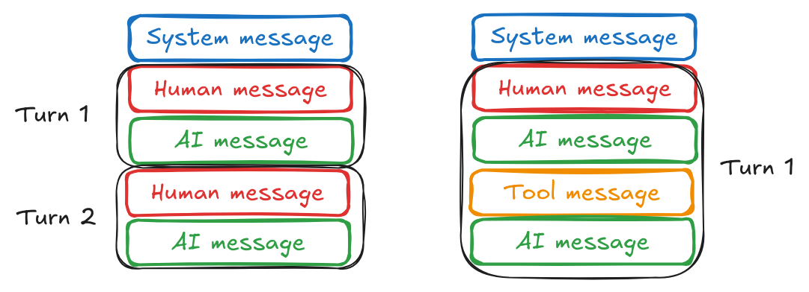

## Overview
Chat history is a record of the conversation between the user and the chat model. It is used to maintain context and state throughout the conversation. The chat history is sequence of messages, each of which is associated with a specific role, such as "user", "assistant", "system", or "tool".

Most conversations start with a system message that sets the context for the conversation. This is followed by a user message containing the user's input, and then an assistant message containing the model's response.

A full conversation often involves a combination of two patterns of alternating messages:

- The user and the assistant representing a back-and-forth conversation.
- The assistant and tool messages representing an "agentic" workflow where the assistant is invoking tools to perform specific tasks.

## Managing chat history
- Since chat models have a maximum limit on input size, it's important to manage chat history and trim it as needed to avoid exceeding the context window.




## LangChain: Chat History
In conversational AI applications, maintaining context across multiple turns is crucial for the AI to provide coherent and relevant responses. This is where Chat History comes into play. Chat history refers to the record of past messages exchanged between a user and an AI model.

## 💬 What is Chat History?
Chat history is essentially a sequential log of all HumanMessage and AIMessage objects (and sometimes SystemMessage, ToolMessage, etc.) that have occurred in a conversation. When you send a new message to a chat model, you typically include the entire chat history so that the model has the full context of the ongoing dialogue.

## 🎯 Why is Chat History Important?
- Contextual Understanding: Without chat history, an LLM would treat each new user input as a completely isolated query. It wouldn't remember previous questions, the user's preferences, or the flow of the conversation. Chat history allows the AI to understand references to earlier statements, follow up on previous topics, and maintain a consistent persona.

- Coherent Responses: By having access to the full conversation, the AI can generate responses that are more natural, relevant, and avoid repeating information or contradicting itself.

- Personalization: Over time, chat history can help an AI "learn" about a specific user's style, preferences, or ongoing tasks, leading to more personalized interactions.

## 🔄 How Chat History is Managed in LangChain
At its simplest, chat history is just a Python list of BaseMessage objects. When you invoke a chat model, you pass this list as input.
```python
from langchain_google_genai import ChatGoogleGenerativeAI
from langchain_core.messages import HumanMessage, AIMessage, SystemMessage
import os, logging
from dotenv import load_dotenv

load_dotenv()

logger = logging.getLogger(__name__)  # 👈 Uses the module name
logger.setLevel(logging.INFO)

if not logger.handlers:
    ch = logging.StreamHandler()
    fh = logging.FileHandler("04_chat_history.log")

    formatter = logging.Formatter('%(asctime)s - %(name)s - %(levelname)s - %(message)s')
    ch.setFormatter(formatter)
    fh.setFormatter(formatter)

    logger.addHandler(ch)
    logger.addHandler(fh)

# Example usage
logger.info("This log message includes the module name.")
api_key = os.getenv("GOOGLE_API_KEY")

chat_model = ChatGoogleGenerativeAI(
    api_key=api_key,
    model="gemini-2.5-flash",
    temperature=0.7
)

# Initialize chat history
chat_history = [
    SystemMessage(content="You are a helpful assistant."),
    HumanMessage(content="What is the capital of France?")
]

# First interaction
response_1 = chat_model.invoke(chat_history)
chat_history.append(AIMessage(content=response_1.content))
logger.info(f"AI: {response_1.content}")

# Second interaction, passing the updated history
chat_history.append(HumanMessage(content="And what about Germany?"))
response_2 = chat_model.invoke(chat_history)
chat_history.append(AIMessage(content=response_2.content))
logger.info(f"AI: {response_2.content}")
```
- Run
```
uv run week_05/04_chat_history/main.py
```
- Output
```
2025-07-29 13:13:07,305 - __main__ - INFO - This log message includes the module name.
2025-07-29 13:13:07,841 - __main__ - INFO - AI: The capital of France is Paris.
2025-07-29 13:13:08,763 - __main__ - INFO - AI: The capital of Germany is Berlin.
```
In the example above, chat_history is explicitly managed by appending new HumanMessage and AIMessage objects after each turn.

## 🧠 Memory in LangChain
While manually managing a list of messages works for simple cases, LangChain provides a more sophisticated concept called Memory to handle chat history. Memory modules abstract away the complexities of storing, retrieving, and summarizing chat history, making it easier to build robust conversational agents.

Memory components often integrate with Runnable chains and agents to automatically manage the history. Some common types of memory include:

- ChatMessageHistory: A simple in-memory storage for messages. It's often used as a building block for other memory types.
```python
from langchain_core.chat_history import ChatMessageHistory
from langchain_core.messages import HumanMessage, AIMessage

history = ChatMessageHistory()
history.add_user_message("Hi!")
history.add_ai_message("Hello there!")

# print(history.messages)
# Output: [HumanMessage(content='Hi!'), AIMessage(content='Hello there!')]
```

- ConversationBufferMemory: Stores all messages in a buffer and passes them directly to the model. This is the simplest form of memory but can quickly exceed context window limits for long conversations.
```python
# from langchain.memory import ConversationBufferMemory # Requires langchain package
# memory = ConversationBufferMemory()
# memory.save_context({"input": "Hi"}, {"output": "What's up"})
# print(memory.load_memory_variables({}))
```
- ConversationSummaryMemory: Summarizes past conversations to keep the history within the context window. This is useful for very long conversations where you don't want to lose context but need to manage token usage.

- ConversationBufferWindowMemory: Stores only the last k messages. This is a good compromise for managing context window limits while retaining recent conversation turns.

- ConversationTokenBufferMemory: Similar to ConversationBufferWindowMemory, but it keeps messages up to a certain token limit rather than a fixed number of messages.

## ⚙️ Integrating Memory with Chains
Memory modules are typically integrated into LangChain Chains or Agents to automate the process of loading and saving chat history. When you use a chain with memory, you don't manually pass the chat_history list; the memory component handles it behind the scenes.
```python
# Conceptual example with a chain and memory
# from langchain.chains import ConversationChain # Requires langchain package
# from langchain.memory import ConversationBufferMemory
# from langchain_google_genai import ChatGoogleGenerativeAI
# import os
# from dotenv import load_dotenv

# load_dotenv()
# api_key = os.getenv("GOOGLE_API_KEY")

# chat_model_with_memory = ChatGoogleGenerativeAI(
#     api_key=api_key,
#     model="gemini-1.5-flash",
#     temperature=0.7
# )

# conversation = ConversationChain(
#     llm=chat_model_with_memory,
#     memory=ConversationBufferMemory()
# )

# # The memory automatically tracks input/output
# # response_1 = conversation.predict(input="My favorite color is blue.")
# # print(f"AI: {response_1}")

# # response_2 = conversation.predict(input="What is my favorite color?")
# # print(f"AI: {response_2}")
```
## ⚠️ Context Window Management
A critical aspect of chat history is managing the context window (or token limit) of the underlying LLM. If the combined length of the system message, chat history, and current input message exceeds the model's context window, the model will truncate the input or raise an error. LangChain's various memory types (like ConversationSummaryMemory or ConversationBufferWindowMemory) are designed to help mitigate this issue by summarizing or trimming the history.

Understanding and effectively managing chat history is paramount for building sophisticated and user-friendly conversational AI applications.