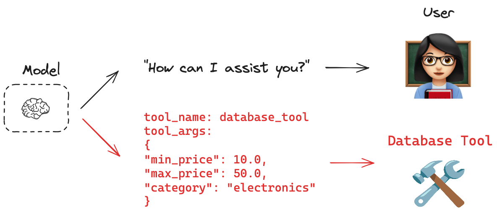
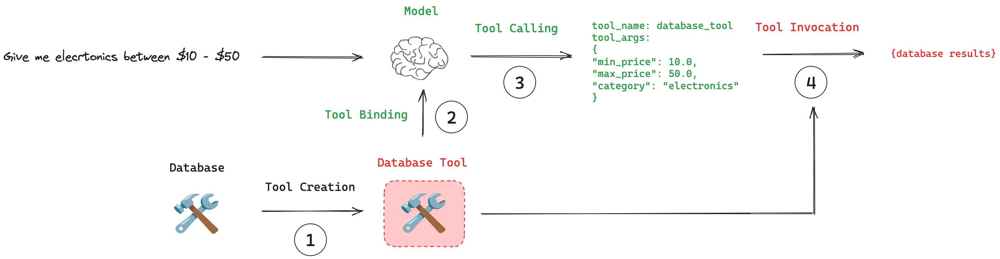

## Overview
Many AI applications interact directly with humans. In these cases, it is appropriate for models to respond in natural language. But what about cases where we want a model to also interact directly with systems, such as databases or an API? These systems often have a particular input schema; for example, APIs frequently have a required payload structure. This need motivates the concept of tool calling. You can use tool calling to request model responses that match a particular schema.



---

## Key concepts
- Tool Creation: Use the @tool decorator to create a tool. A tool is an association between a function and its schema.
- Tool Binding: The tool needs to be connected to a model that supports tool calling. This gives the model awareness of the tool and the associated input schema required by the tool.
- Tool Calling: When appropriate, the model can decide to call a tool and ensure its response conforms to the tool's input schema.
- Tool Execution: The tool can be executed using the arguments provided by the model.



---

## Recommended usage
This pseudocode illustrates the recommended workflow for using tool calling. Created tools are passed to .bind_tools() method as a list. This model can be called, as usual. If a tool call is made, model's response will contain the tool call arguments. The tool call arguments can be passed directly to the tool.

## Example
- main.py
```python
import os
from dotenv import load_dotenv
import logging
from langchain.agents import initialize_agent, AgentType
from langchain_google_genai import ChatGoogleGenerativeAI
from langchain_core.tools import tool

logger = logging.getLogger(__name__)  # 👈 Uses the module name
logger.setLevel(logging.INFO)

if not logger.handlers:
    ch = logging.StreamHandler()
    fh = logging.FileHandler("06_tool_calling.log")

    formatter = logging.Formatter('%(asctime)s - %(name)s - %(levelname)s - %(message)s')
    ch.setFormatter(formatter)
    fh.setFormatter(formatter)

    logger.addHandler(ch)
    logger.addHandler(fh)

# Example usage
logger.info("This log message includes the module name.")

@tool
def multiply(a: int, b: int) -> int:
   """Multiply two numbers."""
   return a * b

def main():
    load_dotenv()
    logger.info("Environment variables loaded from .env file (if present).")
    api_key = os.getenv("GOOGLE_API_KEY")
    # ... (API key check) ...
    if api_key:
        # Print last 4 character of key
        logger.info(f"GOOGLE_API_KEY: ********{api_key[:4]}")
    else:
        logger.error("Error: GOOGLE_API_KEY not found in environment variables.")
        return # Exit if no API key

    logger.info("Creating a ChatGoogleGenerativeAI instance with 'gemini-2.5-flash' model.")
    llm = ChatGoogleGenerativeAI(
        api_key=api_key,
        model="gemini-2.5-flash", # Using the specified Gemini model
        temperature=0.7 # Controls randomness: 0.0 (deterministic) to 1.0 (creative)
    )
    logger.info("Chat model successfully created!")

    tool_list = [multiply]

    llm_with_tools = llm.bind_tools(tools=tool_list)

    logger.info("========================= Asking general question =========================")
    logger.info(llm_with_tools.invoke("Where is the capital of France?"))

    logger.info("========================= Asking tool calling question =========================")
    logger.info(llm_with_tools.invoke("what is multiplied 5 and 4?"))

if __name__=='__main__':
    main()
```
- Run
```bash
uv run week_05/06_tool_calling/main.py
```
- Output
```
2025-07-31 22:13:02,505 - __main__ - INFO - This log message includes the module name.
2025-07-31 22:13:02,508 - __main__ - INFO - Environment variables loaded from .env file (if present).
2025-07-31 22:13:02,508 - __main__ - INFO - GOOGLE_API_KEY: ********AIza
2025-07-31 22:13:02,508 - __main__ - INFO - Creating a ChatGoogleGenerativeAI instance with 'gemini-2.5-flash' model.
2025-07-31 22:13:02,522 - __main__ - INFO - Chat model successfully created!
2025-07-31 22:13:02,526 - __main__ - INFO - ========================= Asking general question =========================
2025-07-31 22:13:03,440 - __main__ - INFO - content='The capital of France is Paris.' additional_kwargs={} response_metadata={'prompt_feedback': {'block_reason': 0, 'safety_ratings': []}, 'finish_reason': 'STOP', 'model_name': 'gemini-2.5-flash', 'safety_ratings': []} id='run--30f88486-0977-4cc9-9f4b-42d6164ed264-0' usage_metadata={'input_tokens': 53, 'output_tokens': 41, 'total_tokens': 94, 'input_token_details': {'cache_read': 0}, 'output_token_details': {'reasoning': 34}}
2025-07-31 22:13:03,440 - __main__ - INFO - ========================= Asking tool calling question =========================
2025-07-31 22:13:04,113 - __main__ - INFO - content='' additional_kwargs={'function_call': {'name': 'multiply', 'arguments': '{"a": 5.0, "b": 4.0}'}} response_metadata={'prompt_feedback': {'block_reason': 0, 'safety_ratings': []}, 'finish_reason': 'STOP', 'model_name': 'gemini-2.5-flash', 'safety_ratings': []} id='run--102a3d91-31c6-43a6-87ea-6542c4cb16a5-0' tool_calls=[{'name': 'multiply', 'args': {'a': 5.0, 'b': 4.0}, 'id': '4696bffe-d609-4ec2-92d0-32e027602cb0', 'type': 'tool_call'}] usage_metadata={'input_tokens': 55, 'output_tokens': 89, 'total_tokens': 144, 'input_token_details': {'cache_read': 0}, 'output_token_details': {'reasoning': 71}}
```

## Forcing tool use
By default, the model has the freedom to choose which tool to use based on the user's input. However, in certain scenarios, you might want to influence the model's decision-making process. LangChain allows you to enforce tool choice (using tool_choice), ensuring the model uses either a particular tool or any tool from a given list. 

## Best practices
When designing tools to be used by a model, it is important to keep in mind that:

- Models that have explicit tool-calling APIs will be better at tool calling than non-fine-tuned models.
- Models will perform better if the tools have well-chosen names and descriptions.
- Simple, narrowly scoped tools are easier for models to use than complex tools.
- Asking the model to select from a large list of tools poses challenges for the model.