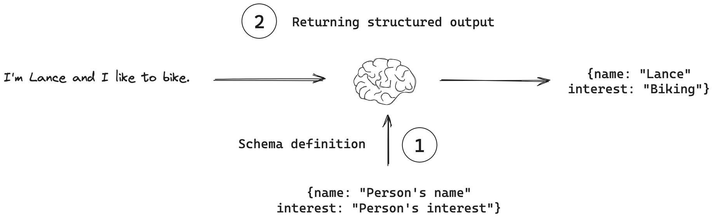
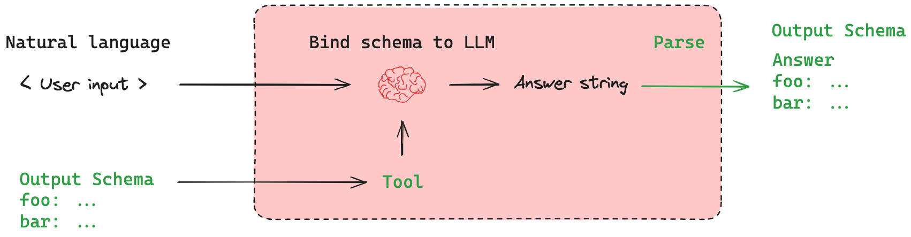

## Overview
For many applications, such as chatbots, models need to respond to users directly in natural language. However, there are scenarios where we need models to output in a structured format. For example, we might want to store the model output in a database and ensure that the output conforms to the database schema. This need motivates the concept of structured output, where models can be instructed to respond with a particular output structure.



---

## Recommended usage
```
# Define schema
schema = {"foo": "bar"}
# Bind schema to model
model_with_structure = model.with_structured_output(schema)
# Invoke the model to produce structured output that matches the schema
structured_output = model_with_structure.invoke(user_input)
```

## Schema definition
Pydantic is particularly useful for defining structured output schemas because it offers type hints and validation.
- Example schema with pydantic
```python
from pydantic import BaseModel, Field
class ResponseFormatter(BaseModel):
    """Always use this tool to structure your response to the user."""
    answer: str = Field(description="The answer to the user's question")
    followup_question: str = Field(description="A followup question the user could ask")
```
## Returning structured output
With a schema defined, we need a way to instruct the model to use it. While one approach is to include this schema in the prompt and ask nicely for the model to use it, this is not recommended. Several more powerful methods that utilizes native features in the model provider's API are available.

- Using tool calling

- JSON mode

- Structured output method



---

## Example
- Run
```bash
uv run week_05/07_structured_output/main.py
```
- Output
```
2025-08-01 06:03:12,112 - __main__ - INFO - Environment variables loaded from .env file (if present).
2025-08-01 06:03:12,113 - __main__ - INFO - GOOGLE_API_KEY: ********AIza
2025-08-01 06:03:12,113 - __main__ - INFO - Creating a ChatGoogleGenerativeAI instance with 'gemini-2.5-flash' model.
2025-08-01 06:03:12,126 - __main__ - INFO - Chat model successfully created!
2025-08-01 06:03:12,128 - __main__ - INFO - --- Simplified Sentiment Analysis Examples ---
2025-08-01 06:03:12,128 - __main__ - INFO - 
--- Analysis 1 ---
2025-08-01 06:03:12,128 - __main__ - INFO - Input Text: "I absolutely love this product! It's fantastic."
2025-08-01 06:03:13,669 - __main__ - INFO - 
Structured Output:
2025-08-01 06:03:13,669 - __main__ - INFO -   Sentiment: POSITIVE
2025-08-01 06:03:13,669 - __main__ - INFO -   Reason: The text uses strong positive words like 'love' and 'fantastic' to express clear approval of the product.
2025-08-01 06:03:13,669 - __main__ - INFO -   Confidence: 0.98
2025-08-01 06:03:13,670 - __main__ - INFO - 
Full Pydantic object (JSON):
2025-08-01 06:03:13,670 - __main__ - INFO - {
  "sentiment": "POSITIVE",
  "reason": "The text uses strong positive words like 'love' and 'fantastic' to express clear approval of the product.",
  "confidence_score": 0.98
}
2025-08-01 06:03:13,670 - __main__ - INFO - 
--- Analysis 2 ---
2025-08-01 06:03:13,670 - __main__ - INFO - Input Text: "The service was terrible and the food was cold."
2025-08-01 06:03:14,927 - __main__ - INFO - 
Structured Output:
2025-08-01 06:03:14,927 - __main__ - INFO -   Sentiment: NEGATIVE
2025-08-01 06:03:14,927 - __main__ - INFO -   Reason: The text uses strong negative descriptors like 'terrible' for service and 'cold' for food, indicating a poor experience.
2025-08-01 06:03:14,927 - __main__ - INFO -   Confidence: 0.95
2025-08-01 06:03:14,927 - __main__ - INFO - 
Full Pydantic object (JSON):
2025-08-01 06:03:14,927 - __main__ - INFO - {
  "sentiment": "NEGATIVE",
  "reason": "The text uses strong negative descriptors like 'terrible' for service and 'cold' for food, indicating a poor experience.",
  "confidence_score": 0.95
}

...
...
...
...
```