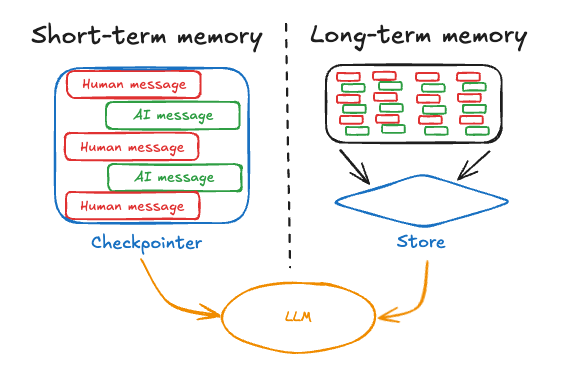

## Overview
Memory is a system that remembers information about previous interactions. For AI agents, memory is crucial because it lets them remember previous interactions, learn from feedback, and adapt to user preferences.

- **Short-term memory**, or thread-scoped memory, tracks the ongoing conversation by maintaining message history within a session. LangGraph manages short-term memory as a part of your agent's state. State is persisted to a database using a checkpointer so the thread can be resumed at any time. Short-term memory updates when the graph is invoked or a step is completed, and the State is read at the start of each step.

- **Long-term memory** stores user-specific or application-level data across sessions and is shared across conversational threads. It can be recalled at any time and in any thread. Memories are scoped to any custom namespace, not just within a single thread ID. LangGraph provides stores (reference doc) to let you save and recall long-term memories.

---

==================

## Memory in LangGraph

**1. What is Memory and Why is it Important for AI Agents?**

*  Memory in AI agents allows them to remember past interactions, learn from feedback, and adapt to user preferences over time.
* It's crucial for:
    * **Efficiency:** Avoiding repetitive questions or tasks.
    * **Personalization:** Tailoring responses and actions to individual users.
    * **User Satisfaction:** Providing a more natural and helpful conversational experience.
    * **Complex Tasks:** Handling multi-turn conversations and long-running processes.

---

**2. Types of Memory in LangGraph**

Memory in LangGraph is primarily categorized by its recall scope:

**A. Short-Term Memory (Thread-Scoped Memory)**

* **Scope:** Manages the ongoing conversation within a *single session* or "thread."
* **How it Works:**
    * It's part of the agent's current "state."
    * Uses a `checkpointer` to save the conversation state to a database.
    * Allows threads to be paused and resumed later without losing context.
    * Updates whenever the agent's graph is invoked or a step is completed.

**B. Long-Term Memory**

* **Scope:** Stores user-specific or application-level data that persists *across multiple sessions* and conversational threads.
* **How it Works:**
    * Can be recalled at any time from a custom "namespace" (like a user ID).
    * LangGraph provides `stores` to save and retrieve these memories.
* **Analogy to Human Memory (and how it applies to AI):**

    1.  **Semantic Memory (Facts & Concepts):**
        * **Human:** Remembering facts (e.g., "Paris is the capital of France").
        * **AI Agent:** Retaining specific user preferences, information (e.g., a user's favorite color, their address). This can be like building a continuously updated "user profile" or a collection of documents.

    2.  **Episodic Memory (Past Events & Actions):**
        * **Human:** Remembering specific events (e.g., "What I did last Saturday").
        * **AI Agent:** Recalling past interactions or examples of how a task was accomplished. Often implemented through "few-shot example prompting" where the agent is shown examples of successful interactions to learn from.

    3.  **Procedural Memory (Rules & How-To's):**
        * **Human:** Remembering how to do things (e.g., riding a bike).
        * **AI Agent:** Remembering the "rules" or steps used to perform tasks. For AI, this is a combination of its underlying model's "weights," the agent's code, and its "prompt" (the instructions it follows). Prompt modification (e.g., through "Reflection" or meta-prompting) is a common way to refine this type of memory.

---

**3. Methods for Writing Memories**

How and when memories are saved can impact performance:

* **"In the Hot Path"**:
    * Memory updates are done in real-time as part of the primary application flow.
    * Ensures the most up-to-date information is immediately available.
    * Can introduce latency if the memory write operation is slow.
* **"In the Background"**:
    * Memory updates are performed as a separate, asynchronous task.
    * Avoids adding latency to the main application response.
    * Information might not be immediately available after an interaction, depending on the background process's speed.

---
