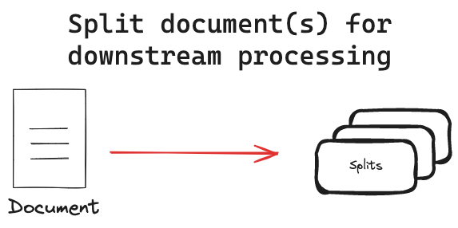

# 📄 Text Splitters in LangChain

* **Problem**:
  LLMs and vector databases have **context window limits** (can’t handle arbitrarily long text).
  → If you feed a long PDF, book, or article directly, the system breaks.

* **Solution**:
  **Text Splitters** break large text into **smaller, overlapping chunks** that:

  * Fit within token limits
  * Maintain context (via overlap)
  * Improve retrieval quality in RAG systems

 

---

* **Common Splitters**:

  * `CharacterTextSplitter` → Splits by character length.
  * `RecursiveCharacterTextSplitter` → Splits by natural boundaries (paragraph → sentence → word).
  * `TokenTextSplitter` → Splits based on model tokens.

* **Key Idea**:
  Splitting must **balance size + overlap**:

  * Too small → LLM loses context
  * Too large → Doesn’t fit / retrieval gets noisy

---

# 🧑‍💻 Example: RecursiveCharacterTextSplitter

```python
# Install
!pip install langchain==0.3.26

from langchain_text_splitters import RecursiveCharacterTextSplitter

# 1. Long text (simulate a document)
long_text = """
LangChain is a framework for building applications with LLMs.
Retrieval is a core concept: you store documents as embeddings
and fetch the most relevant ones when answering a query.
Text splitters make this possible by chunking long documents
into smaller pieces that fit within context windows.
"""

# 2. Create a text splitter
splitter = RecursiveCharacterTextSplitter(
    chunk_size=50,   # max characters per chunk
    chunk_overlap=10 # overlap to preserve context
)

# 3. Split into chunks
chunks = splitter.split_text(long_text)

print("Chunks:")
for i, c in enumerate(chunks, 1):
    print(f"{i}: {c}")
```

---

### ✅ Output (simplified)

```
1: LangChain is a framework for building applications wi…
2: cations with LLMs. Retrieval is a core concept: you s…
3: elevant ones when answering a query. Text splitters m…
4: splitters make this possible by chunking long documen…
```

---

Got it ✅ — let’s fill that gap. The LangChain docs list **different approaches to splitting**. Here’s a **5-minute summary** with each approach explained in a few sentences:

---

# 🔨 Approaches to Text Splitting in LangChain

### 1. **Character Splitter**

* Splits text into fixed-size chunks based on **character count**.
* Very simple, but can **cut mid-sentence or mid-word**, which may hurt meaning.
* Works when structure doesn’t matter much (e.g., logs).

---

### 2. **Recursive Character Splitter**

* Tries to split along **natural boundaries** (paragraph → sentence → word).
* If the text is still too long, it falls back to smaller units.
* Produces more coherent chunks → great for documents, RAG pipelines.
* Default & most recommended splitter.

---

### 3. **Token Splitter**

* Splits based on **model tokens** (what the LLM actually sees).
* Prevents “too many tokens” errors when sending input to a model.
* Useful when exact token count control is important (e.g., OpenAI, Gemini, Claude).

---

### 4. **Text-Specific Splitters**

* Some splitters are designed for **structured formats** like:

  * **Markdown** (split by headings, lists, code blocks).
  * **Python / Code** (split by function, class, etc.).
  * **HTML / XML** (split by tags).
* These keep semantic meaning by respecting the structure of the text.

---

### 5. **Sentence / Semantic Splitters**

* Use sentence boundaries or even **semantic similarity** to decide chunks.
* More advanced — sometimes use NLP libraries (like spaCy, NLTK).
* Helps when meaning must stay intact (e.g., Q\&A on research papers).

---

# 🧑‍💻 Quick Example with Recursive Splitter

(From earlier)

```python
from langchain_text_splitters import RecursiveCharacterTextSplitter

text = "LangChain makes LLM apps. Retrieval and chunking are key for RAG."
splitter = RecursiveCharacterTextSplitter(chunk_size=30, chunk_overlap=5)
print(splitter.split_text(text))
```

---
# 🎯 Key Takeaways

* **Text splitters** = preprocessing step before embeddings + retrieval.
* Ensure **chunks are small enough to fit in context**, but **overlap enough** to keep meaning.


* **Character Splitter** → dumb but simple.
* **Recursive Splitter** → smart & default.
* **Token Splitter** → safe for model input.
* **Text-Specific Splitters** → keep structure (Markdown, Code, HTML).
* **Semantic Splitters** → preserve meaning best, but more complex.


Most RAG pipelines use `RecursiveCharacterTextSplitter` as default.

---
