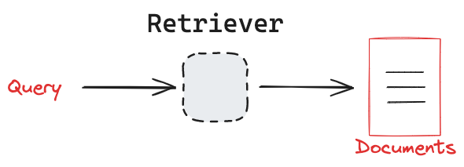
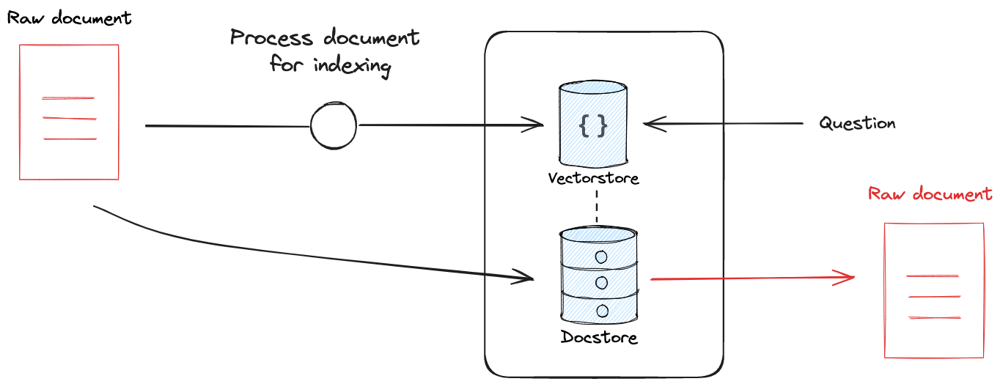

# 🔎 Retrievers in LangChain (5-Minute Lesson)

## 1. Concept: What is a Retriever?

* A **retriever** is an **interface** in LangChain that knows **how to fetch relevant documents**.
* Instead of you calling `.similarity_search()` directly on a vector store, a retriever gives you a **standardized `.invoke(query)` API**.
* This makes retrievers **pluggable**:

  * Vector store retriever (Chroma, Qdrant, Pinecone, …)
  * BM25 retriever (keyword-based)
  * Hybrid retriever (combining keyword + vectors)

📌 Think of it as a **search engine component** inside your LLM pipeline.

---
### Key concept



---

### Source document retention



---

## 2. Why Use Retrievers?

* **Abstraction** → you can swap different backends easily.
* **Flexibility** → retrievers can implement extra logic (score thresholds, re-ranking, filters).
* **Integration** → used inside higher-level chains like **RAG** (`create_retrieval_chain`).

---

## 3. Types of Retrievers

* **Vector Store Retriever** → fetches by semantic similarity (most common).
* **SelfQueryRetriever** → lets LLM decide filters + search query.
* **MultiQueryRetriever** → generates multiple reformulations of query.
* **Ensemble / Hybrid** → combine different retrieval methods.

---

## 4. Minimal Example (Chroma Retriever + Gemini)

```python
# Install
!pip install langchain==0.3.26 langchain-google-genai chromadb

from langchain_google_genai import GoogleGenerativeAIEmbeddings
from langchain_community.vectorstores import Chroma
from langchain.schema import Document

# 1. Embeddings + documents
embeddings = GoogleGenerativeAIEmbeddings(model="models/embedding-001")
docs = [
    Document(page_content="Retrievers fetch relevant documents."),
    Document(page_content="Vector stores enable semantic search."),
    Document(page_content="LangChain helps build applications with LLMs."),
]

# 2. Build vector store
vectorstore = Chroma.from_documents(docs, embeddings)

# 3. Convert vector store to retriever
retriever = vectorstore.as_retriever()

# 4. User query
query = "How do I get documents relevant to my question?"

# 5. Use retriever
results = retriever.invoke(query)
print("🔎 Query:", query)
for i, r in enumerate(results, 1):
    print(f"{i}. {r.page_content}")
```

---

## 5. Expected Output

```
🔎 Query: How do I get documents relevant to my question?
1. Retrievers fetch relevant documents.
2. Vector stores enable semantic search.
```

---

## 6. Key Takeaways

* A **Retriever** is a **wrapper around a search strategy**.
* It gives a **unified `.invoke(query)` interface** → easier to integrate into chains.
* The most common retriever is the **Vector Store Retriever**, but others exist.
* Retrievers are the **bridge** between your **data** and the **LLM** (especially in RAG).

---

⚡ That’s enough for 5 minutes:

* Explain → Demo → Show retrieved docs → Highlight retrievers as **standard plug-in interface**.

---