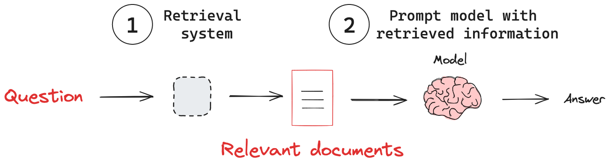

# 🤖 Retrieval-Augmented Generation (RAG) — 5 Min Lesson

## 1. What is RAG?

* **Problem**: LLMs don’t know your private or updated data.
* **Solution**: Retrieval-Augmented Generation (RAG) =

  1. **Retrieve** relevant docs from a knowledge base.
  2. **Augment** the prompt with those docs.
  3. **Generate** an answer using both the docs + LLM knowledge.

📌 Think of it as: **“Give the model the right notes before the exam.”**

## 2. Why RAG Matters

* Keeps answers **up-to-date** with your data.
* Lets you **add private/domain knowledge** without retraining.
* Cheaper and faster than fine-tuning.

---

## 3. Workflow Diagram



---

---

## 4. Colab Demo (Chroma + Gemini, AI Tutor Prompt)

```python
!pip install langchain==0.3.26 langchain-google-genai chromadb

from langchain_google_genai import ChatGoogleGenerativeAI, GoogleGenerativeAIEmbeddings
from langchain_community.vectorstores import Chroma
from langchain.chains import create_retrieval_chain
from langchain.chains.combine_documents import create_stuff_documents_chain
from langchain.prompts import ChatPromptTemplate
from langchain.schema import Document

# 1. Embeddings + LLM
embeddings = GoogleGenerativeAIEmbeddings(model="models/embedding-001")
llm = ChatGoogleGenerativeAI(model="gemini-2.5-flash", api_key="YOUR_API_KEY")

# 2. Example documents
docs = [
    Document(page_content="LangChain is a framework for building applications with LLMs."),
    Document(page_content="RAG stands for Retrieval-Augmented Generation."),
    Document(page_content="Chroma is an open-source vector database for storing embeddings."),
]

# 3. Vector store + retriever
vectorstore = Chroma.from_documents(docs, embeddings)
retriever = vectorstore.as_retriever()

# 4. AI Tutor prompt
prompt = ChatPromptTemplate.from_template(
    """You are an AI tutor. Use the provided context to clearly explain the concept.
If the context is incomplete, combine it with your own knowledge.

Context:
{context}

Question: {input}
"""
)

# 5. Build RAG chain
doc_chain = create_stuff_documents_chain(llm, prompt)
rag_chain = create_retrieval_chain(retriever, doc_chain)

# 6. Ask a question
query = "What does RAG mean in LangChain?"
response = rag_chain.invoke({"input": query})

print("🔎 Query:", query)
print("🤖 Answer:", response["answer"])
```

---

## 5. Expected Output

```
🔎 Query: What does RAG mean in LangChain?
🤖 Answer: RAG stands for Retrieval-Augmented Generation. 
It is a technique used in LangChain where a retriever fetches relevant documents 
from a vector database, and an LLM uses them as context to generate grounded answers.
```

---

## 6. Key Teaching Takeaways

* **Retriever** pulls knowledge in.
* **LLM** generates a grounded answer with that knowledge.
* RAG = the **bridge** between your **data** and the **LLM**.
* Today: simple demo. Later (Week 6), we’ll improve retrieval for **better quality**.

---
