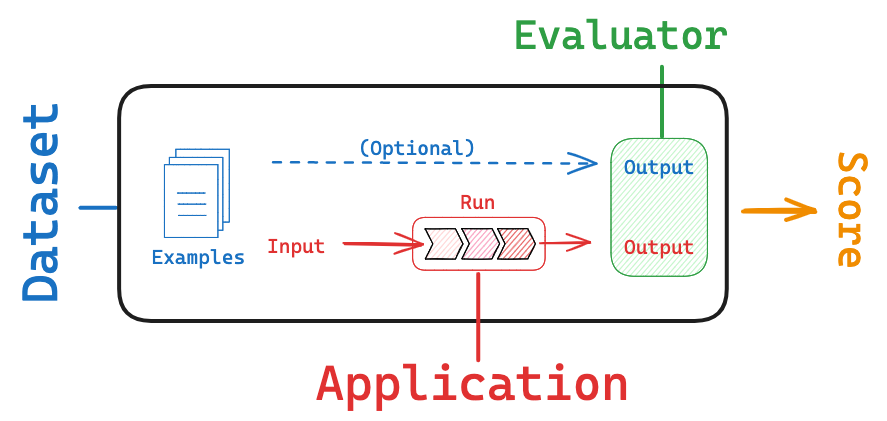

# 🚀 Evaluation in LangChain
Evaluation is the process of assessing the performance and effectiveness of your LLM-powered applications. It involves testing the model's responses against a set of predefined criteria or benchmarks to ensure it meets the desired quality standards and fulfills the intended purpose. This process is vital for building reliable applications.

When building LLM-powered apps, you need to check if your system is **working well**.
This means evaluating not just the raw model output but also how well your **chains, prompts, RAGs, or agents** perform.

LangChain provides tools to make **evaluation systematic** instead of subjective.



---

## ✨ Why Evaluate?

* **Quality control** → Are answers correct, relevant, safe?
* **Comparison** → Which prompt or model performs better?
* **Reliability** → Avoid hallucinations or bad responses.
* **Iteration** → Use results to improve prompts, RAG retrievers, or output parsers.

---

## 🔑 What Can We Evaluate?

1. **LLM outputs directly** (e.g., does it answer correctly?)
2. **Chains or RAG pipelines** (e.g., is retrieved context useful?)
3. **Agents** (e.g., are tool calls accurate & efficient?)

---

## 📂 Types of Evaluation

### 1. **String-based (Exact Match)**

Compare the model’s output to a gold reference.

* Useful for deterministic tasks like classification.
* Example: `"positive"` vs `"positive"` ✅

### 2. **Embedding-based (Semantic Similarity)**

Compare meaning instead of exact words.

* Example: `"The capital is Paris"` ≈ `"Paris is the capital"` ✅

### 3. **LLM-as-Judge**

Use another LLM to **score or critique** outputs.

* Example: Ask the LLM:
  `"Rate if the answer is factually correct on a scale 1–5."`

---

## 🔗 Evaluation & LangSmith

* **LangChain** provides evaluation helpers.
* **LangSmith** is the platform where you can:

  * Log experiment runs
  * Run structured evaluations (gold labels, similarity, LLM judges)
  * Compare prompts, retrievers, or models
  * Track metrics over time

👉 Think of LangChain eval as the **tools** and LangSmith as the **lab**.

---

## 🧑‍💻 Example (Colab-friendly)

We’ll compare **two different prompts** for the same task.

```python
from langchain_google_genai import ChatGoogleGenerativeAI
from langchain.evaluation import load_evaluator

# 1. Initialize LLM
llm = ChatGoogleGenerativeAI(model="gemini-2.5-flash")

# 2. Two different prompts
prompt_a = "Explain AI in one sentence."
prompt_b = "Summarize Artificial Intelligence briefly in one line."

# 3. Get outputs
resp_a = llm.invoke(prompt_a).content
resp_b = llm.invoke(prompt_b).content

print("=== Candidate Outputs ===")
print("A:", resp_a)
print("B:", resp_b)

# 4. Load an evaluator (embedding similarity)
evaluator = load_evaluator("embedding_distance")

score = evaluator.evaluate_strings(
    prediction=resp_a,
    reference=resp_b
)

print("\n=== Evaluation Score (similarity) ===")
print(score)
```

---

## ✅ Example Output (Colab)

```
=== Candidate Outputs ===
A: AI is the science of creating systems that can perform tasks requiring human-like intelligence.
B: AI is a field focused on making machines think and act intelligently like humans.

=== Evaluation Score (similarity) ===
{'score': 0.12}
```

(Scores closer to 0 = more similar, depending on metric.)

If LangSmith is enabled, this run would be stored, and you could **compare prompts visually** in the dashboard.

---

## 🧩 Other Evaluation Options

* **StringEvaluator** → exact match
* **PairwiseEvaluator** → compare two answers and pick better
* **LLM-as-Judge Evaluator** → ask an LLM to score correctness, fluency, or safety

Example (LLM-as-judge):

```python
evaluator = load_evaluator("criteria", criteria="helpfulness", llm=llm)
result = evaluator.evaluate_strings(
    input="What is AI?",
    prediction=resp_a,
)
print(result)
```

Output:

```python
{'score': 4, 'reasoning': 'The answer is clear and helpful.'}
```

### How LangSmith Fits In

Without LangSmith → You run evaluation in Python and just see console output.

With LangSmith →

Each evaluation result is logged to the LangSmith dashboard

You see inputs, predictions, gold labels, scores, and reasoning

You can compare runs across prompts, models, or retrievers

You can share evaluation results with teammates

#### 👉 LangChain = evaluation tools. LangSmith = evaluation lab.
---

## 📌 Takeaway

* **Evaluation is critical** for moving from *toy demos* to *reliable apps*.
* Use **string/embedding similarity** for simple tasks.
* Use **LLM-as-Judge** for nuanced tasks like helpfulness or factuality.
* Combine with **LangSmith** for a full experiment tracking and evaluation workflow.

---

⏳ **10-Minute Structure Suggestion for Class**

1. (2 min) Motivation — why eval matters
2. (2 min) Different types (string, semantic, judge)
3. (3 min) Run Colab example (embedding similarity)
4. (3 min) Discuss LangSmith connection (experiments, dashboards, sharing)