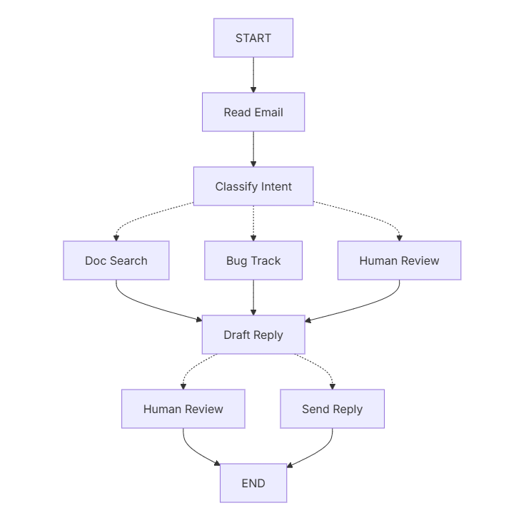

# Week 7: LangGraph Fundamentals — Building Production-Ready AI Agents

This week follows the official LangGraph learning path to build sophisticated, controllable AI agents from basic chatbots to advanced stateful systems.

## 📚 Topics (Official LangGraph Learning Path)
1. **Build a Basic Chatbot**
2. **Add Tools** (Web search capabilities)
3. **Add Memory** (Conversation state persistence)
4. **Add Human-in-the-Loop** (Moderation and review controls)
5. **Customize State** (Custom behavioral state management)
6. **Time Travel** (Explore alternative conversation paths)

## 🚀 Introduction to LangGraph

Imagine that you need to build an AI agent that handles customer support emails. Your product team has given you these requirements:
### The agent should:
- Read incoming customer emails
- Classify them by urgency and topic
- Search relevant documentation to answer questions
- Draft appropriate responses
- Escalate complex issues to human agents
- Schedule follow-ups when needed

### Example scenarios to handle:
- Simple product question: “How do I reset my password?”
- Bug report: “The export feature crashes when I select PDF format”
- Urgent billing issue: “I was charged twice for my subscription!”
- Feature request: “Can you add dark mode to the mobile app?”
- Complex technical issue: “Our API integration fails intermittently with 504 errors”

To implement an agent in LangGraph, you will usually follow the same five steps.



---

### 1. Add New Dependencies
```bash
# Add to requirements.txt:
langgraph==0.6.7
```

### 2. Install Dependencies
```bash
uv --project add -r requirements.txt
```

### 3. Check API Key
- Ensure GOOGLE_API_KEY and TAVILY_API_KEY are defined in .env file

### 4. Run Examples (Official LangGraph Learning Path)
```bash
# 1. Basic chatbot
uv run week_07/01_basic_chatbot/main.py --message "Hello, I'm looking for help with Python!"

# 2. Chatbot with web search tools
uv run week_07/02_add_tools/main.py --message "What are the latest developments in AI?"

# 3. Chatbot with conversation memory
uv run week_07/03_add_memory/main.py --message "Remember that I'm working on a Python project"

# 4. Chatbot with human review controls
uv run week_07/04_human_in_loop/main.py --message "Help me write a sensitive email"

# 5. Chatbot with custom behavioral state
uv run week_07/05_customize_state/main.py --message "Switch to technical mode and explain APIs"

# 6. Time travel through conversation paths
uv run week_07/06_time_travel/main.py --message "Let's explore different conversation paths"
```


## 5. Project Structure (Official LangGraph Learning Path)
```
week_07/
├── README.md                    # This file
├── 01_basic_chatbot/           # Step 1: Basic chatbot foundation
├── 02_add_tools/               # Step 2: Add web search tools
├── 03_add_memory/              # Step 3: Conversation memory
├── 04_human_in_loop/           # Step 4: Human review controls
├── 05_customize_state/         # Step 5: Custom behavioral state
└── 06_time_travel/             # Step 6: Alternative conversation paths
```

## 6. Code Examples (Following Official LangGraph Tutorials)
- [01_basic_chatbot](01_basic_chatbot/) - Foundation chatbot with LangGraph
- [02_add_tools](02_add_tools/) - Add web search and tool capabilities
- [03_add_memory](03_add_memory/) - Persistent conversation state
- [04_human_in_loop](04_human_in_loop/) - Moderation and human review
- [05_customize_state](05_customize_state/) - Custom agent behavioral patterns
- [06_time_travel](06_time_travel/) - Explore alternative conversation paths

## 7. Learning Objectives (Official LangGraph Path)
By the end of this week you will:
- ✅ Build production-ready chatbots with LangGraph
- ✅ Integrate web search and external tools
- ✅ Implement persistent conversation memory
- ✅ Add human moderation and review controls
- ✅ Design custom agent behavioral states
- ✅ Explore alternative conversation paths with time travel

## 8. Useful Links
- [LangGraph Official Tutorial Series](https://langchain-ai.github.io/langgraph/tutorials/get-started/)
- [LangGraph Documentation](https://langchain-ai.github.io/langgraph/)
- [LangGraph Concepts](https://langchain-ai.github.io/langgraph/concepts/why-langgraph/)

---
**Note:** The chatbot techniques learned this week will be used in Week 8's end-to-end project.